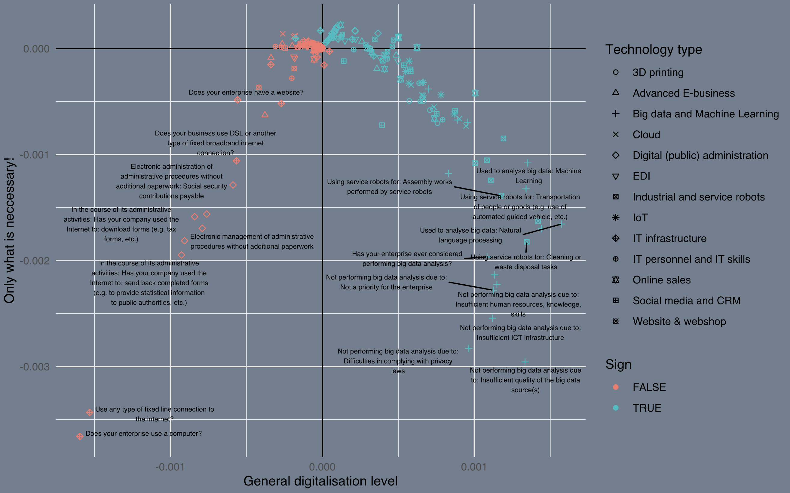

Our recent article in the *Economic Review* investigates the relationship between ICT usage and the profitability of Hungarian manufacturing firms.

My contribution to the final paper is the data analysis part. We applied Multiple Correspondence Analysis (MCA) as dimension reduction, which can be applied to categorical variables rather than numerical ones. This methodology was suited to our problem, as all of ICT characteristics of the firms are represented by dummy or categorical variables.

<figure>

<figcaption aria-hidden="true">The first two factors of our MCA model</figcaption>
</figure>

## Abstract

Digitalisation and Industry 4.0, which represents a cutting-edge dimension in manufacturing is now spreading all over the world. Nowadays, both managers and academics expect that digitalization is the main source of business performance improvement - and the first empirical results proved their positive relationship. The aim of our paper is to examine this relationship by merging two databases - a) Hungarian manufacturing firms data from the ICT usage in enterprise survey managed by Eurostat and b) a database containing the balance sheets and profit and loss statements of Hungarian firms. There are several unique characteristics to our work, e.g., our sample size consists of approx. 1/3rd of the entire population, our performance assessments rely on report-based data instead of perceptual items, finally, we analyse many digital tools and performance indicators. Our results indicate that the prevalence of digital tools in Hungarian manufacturing firms is not at all as widespread as it is usually suggested in the literature. Digitalisation has positive relationships with performance measures are not evident, at least for the selected period. Although, we have concluded that there is a group of companies in which progress in complex digital programs is part of daily business practice, however, the performance implications are blurred even in this group.

The article is accessible in [Hungarian](http://www.kszemle.hu/tartalom/cikk.php?id=2100).
